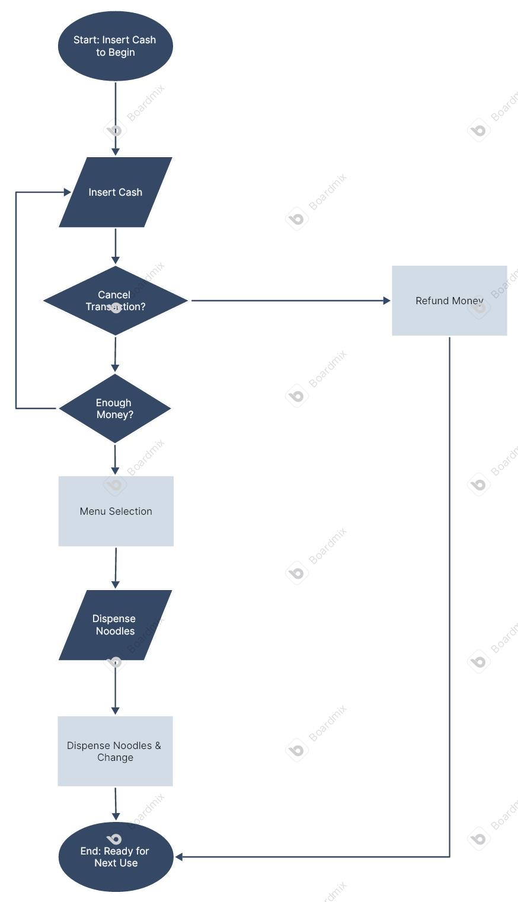
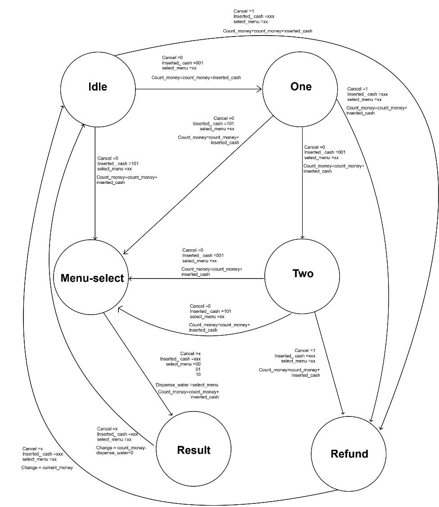
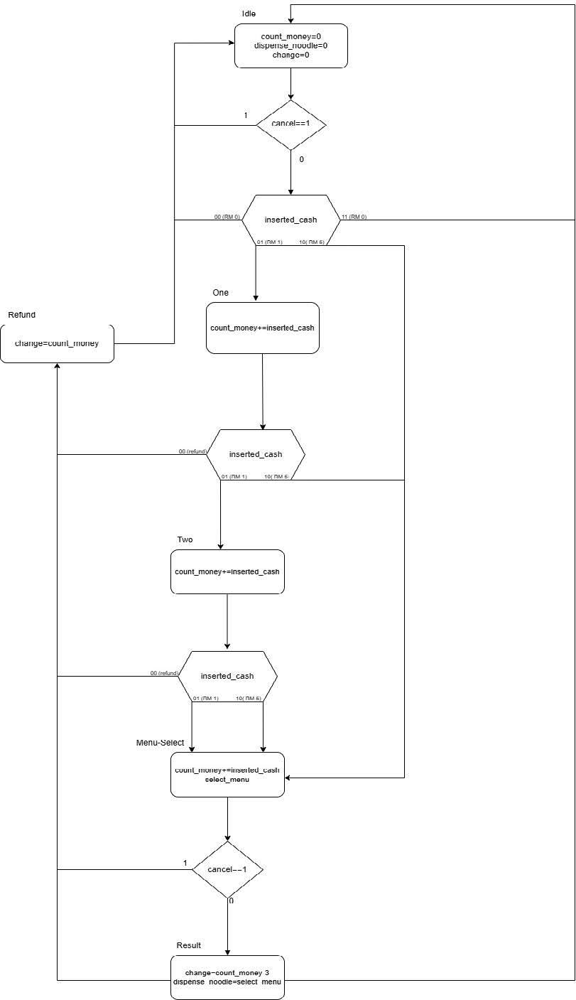
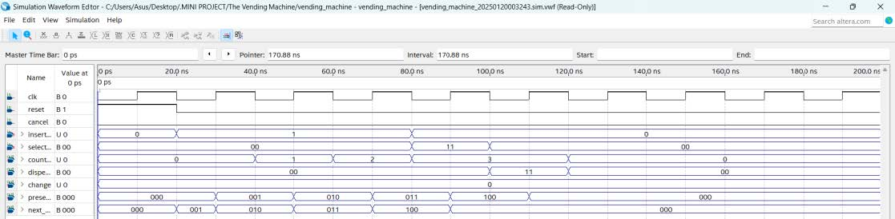

# Digital Logic Vending Machine System (Verilog FSM)

## Overview
This project is a purely digital logic design of an automated vending machine, engineered using Verilog. The core of the system is a complex Finite State Machine (FSM) capable of processing multi-variable inputs, managing state transitions, and executing precise output logic without the need for a microcontroller.

## Key Features
* **Currency Tracking:** Accumulates coin inputs and calculates total inserted value.
* **Menu Selection & Dispensing:** Validates user selection against the inserted balance before triggering the dispensing logic.
* **Refund & Change Logic:** Calculates and outputs the correct change, or refunds the full amount if a transaction is canceled.

## Design Methodology
The system logic was designed from the ground up using fundamental digital design principles before writing the HDL code:
1. **State Diagrams:** To map the overarching user flow and machine states.
2. **ASM Charts (Algorithmic State Machine):** To define the exact hardware conditions and timing for state transitions.
3. **Truth Tables:** To synthesize the combinational logic for the outputs.

## Diagrams & Logic

### 1. Flowchart
The system flow begins with cash insertion and includes decision points for cancellations and sufficient funds

### 2. State Diagram
This diagram illustrates the transitions between Idle, intermediate payment states, and the final Result or Refund states

### 3. ASM Chart
The Algorithmic State Machine (ASM) chart defines the precise hardware execution steps, including real-time change calculation

### 4. Waveform Simulation
Verified simulation results showing successful state transitions and output generation across multiple payment probabilities

## Simulation & Verification
System reliability and logic transitions were verified through rigorous waveform simulations. The testbenches simulate various user edge cases, including insufficient funds, rapid multiple coin insertions, and canceled transactions.
